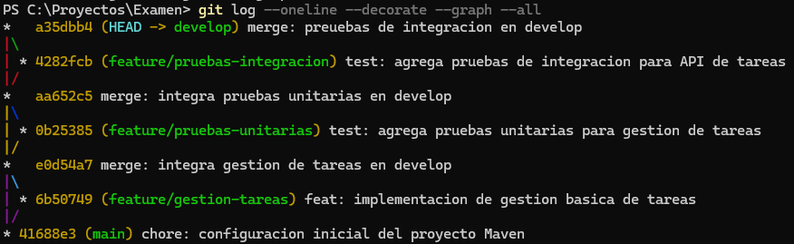
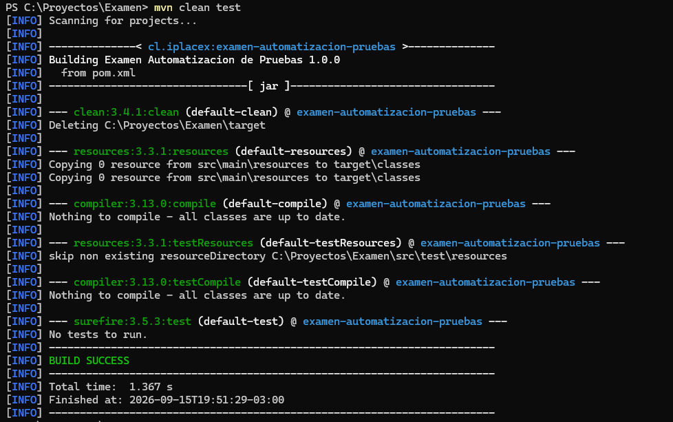
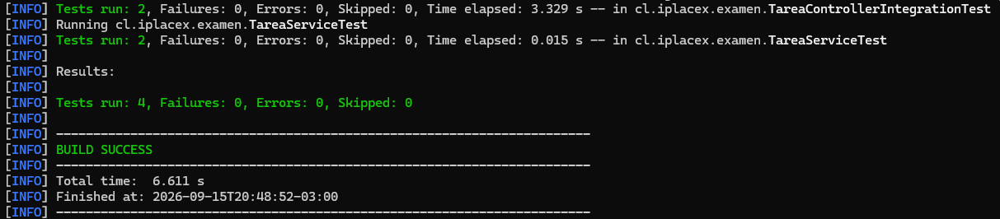
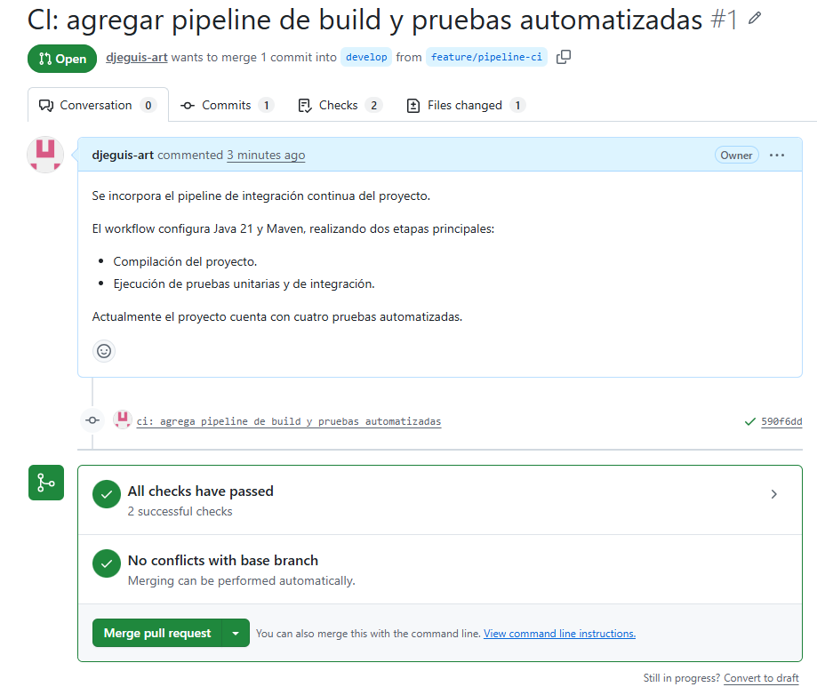
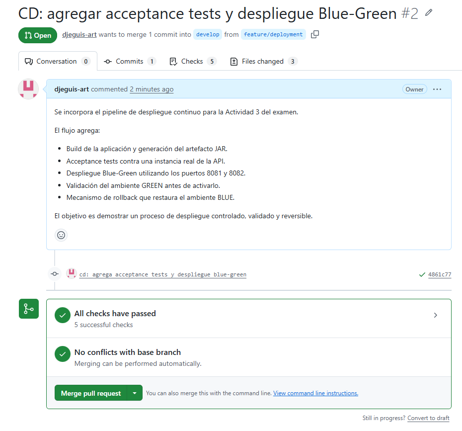
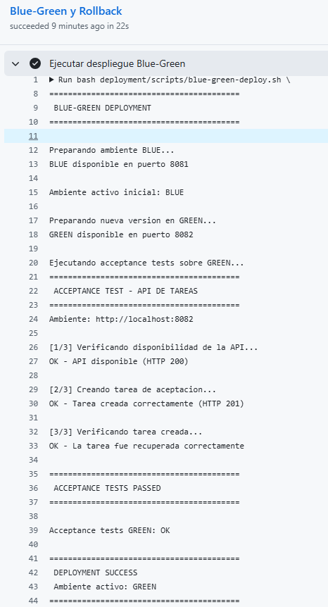
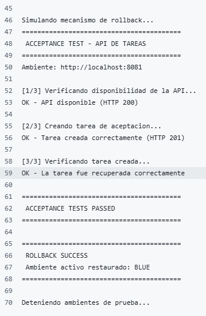
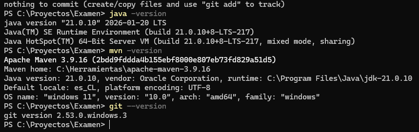
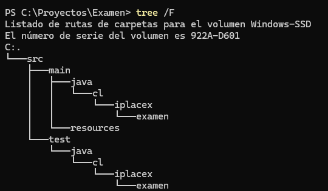

# Examen Final - Automatización de Pruebas

Proyecto desarrollado como parte del Examen Final de la asignatura Automatización de Pruebas.

El objetivo principal del trabajo es aplicar de manera práctica conceptos relacionados con control de versiones, automatización de pruebas, integración continua y despliegue continuo.

Para el desarrollo se implementó una API REST sencilla para la gestión de tareas, utilizando Java, Spring Boot y Maven. A partir de esta aplicación se incorporaron pruebas unitarias, pruebas de integración, acceptance tests y pipelines automatizados mediante GitHub Actions.

---

## Tecnologías utilizadas

- Java 21
- Spring Boot
- Maven
- JUnit 5
- Spring Boot Test
- MockMvc
- Git
- GitHub
- GitHub Actions
- Bash
- Curl

---

## Estrategia de versionado

Se utilizó una estrategia basada en GitFlow simplificado.

La rama `main` representa la versión estable del proyecto, mientras que `develop` funciona como rama de integración.

Las funcionalidades se desarrollaron en ramas independientes:

- `feature/gestion-tareas`
- `feature/pruebas-unitarias`
- `feature/pruebas-integracion`
- `feature/pipeline-ci`
- `feature/deployment`
- `feature/documentacion`

Una vez validadas, las funcionalidades fueron integradas nuevamente a `develop`.



---

## Aplicación desarrollada

La aplicación corresponde a una API REST básica para la administración de tareas.

Cada tarea contiene:

- Identificador.
- Título.
- Estado de completitud.

Los principales endpoints implementados son:

```text
GET  /api/tareas
POST /api/tareas

```

La información se mantiene en memoria, ya que el objetivo principal del proyecto es demostrar la automatización de pruebas y el flujo CI/CD.



---

## Estrategia de pruebas

El proyecto implementa tres niveles de pruebas: unitarias, integración y aceptación.

### Pruebas unitarias

Las pruebas unitarias permiten validar de forma aislada la lógica implementada en `TareaService`.

Dentro de estas pruebas se verifica:

- Creación correcta de una tarea.
- Generación del identificador.
- Estado inicial de la tarea.
- Validación de títulos vacíos.

### Pruebas de integración

Las pruebas de integración utilizan Spring Boot y MockMvc para comprobar el funcionamiento de la API y la comunicación entre el controlador y la capa de servicio.

Se valida:

- Respuesta correcta del endpoint GET.
- Creación de tareas mediante POST.
- Código HTTP 201 al crear una tarea.
- Contenido de la respuesta JSON.

### Acceptance Tests

Como etapa adicional se implementaron pruebas de aceptación ejecutadas contra una instancia real de la aplicación.

Estas pruebas verifican:

1. Que la API se encuentre disponible.
2. Que sea posible crear una tarea mediante una petición HTTP.
3. Que posteriormente la tarea creada pueda ser recuperada desde la API.



---

## Ejecución local de las pruebas

Para ejecutar las pruebas automatizadas del proyecto se utiliza:

```bash
mvn clean test
```

La ejecución correcta entrega como resultado:

```text
Tests run: 4
Failures: 0
Errors: 0
Skipped: 0

BUILD SUCCESS
```

Para compilar y generar el archivo ejecutable JAR se utiliza:

```bash
mvn clean package
```

---

## Integración Continua - CI

El pipeline de Integración Continua se encuentra definido en:

```text
.github/workflows/ci.yml
```

El workflow se ejecuta mediante GitHub Actions y considera principalmente dos etapas:

1. Compilación del proyecto.
2. Ejecución de las pruebas automatizadas.

El pipeline utiliza un runner Ubuntu con Java 21 y Maven.

De esta forma, antes de integrar cambios a la rama `develop`, GitHub Actions verifica automáticamente que el proyecto compile correctamente y que las pruebas unitarias y de integración continúen funcionando.



---

## Despliegue Continuo - CD

El pipeline correspondiente al proceso de despliegue se encuentra definido en:

```text
.github/workflows/cd.yml
```

El flujo implementado considera:

1. Build de la aplicación.
2. Generación del artefacto JAR.
3. Ejecución de Acceptance Tests.
4. Despliegue utilizando una estrategia Blue-Green.
5. Validación del ambiente GREEN.
6. Ejecución de un mecanismo de rollback.

Para este examen se utilizó un ambiente efímero de pruebas proporcionado por el runner Ubuntu de GitHub Actions, donde las instancias de la aplicación se ejecutan durante el pipeline.



---

## Estrategia Blue-Green

Para demostrar un proceso de despliegue controlado se utilizaron dos ambientes de ejecución:

```text
BLUE  -> puerto 8081
GREEN -> puerto 8082
```

El ambiente BLUE representa inicialmente la versión estable de la aplicación.

Posteriormente se levanta una nueva instancia en el ambiente GREEN. Antes de considerarla válida se ejecutan los Acceptance Tests para comprobar que la API responda correctamente y permita realizar las operaciones esperadas.

Si las validaciones son satisfactorias, GREEN pasa a ser considerado el ambiente activo.



---

## Rollback

Después de comprobar el funcionamiento del ambiente GREEN se ejecuta una simulación del mecanismo de rollback.

Para ello se vuelve a validar el ambiente BLUE mediante los Acceptance Tests y posteriormente se restaura como ambiente activo.

Este procedimiento permite demostrar que, ante una eventual falla de una nueva versión, es posible regresar a un estado previamente validado.



---

## Evidencias del proyecto

Durante el desarrollo se registraron evidencias de las principales etapas realizadas.

La configuración inicial del entorno consideró Java 21, Maven y Git:



También se utilizó una estructura estándar de proyecto Maven para separar el código principal y las pruebas:



Las evidencias restantes permiten observar el flujo GitFlow, funcionamiento de la API, pruebas automatizadas, pipelines CI/CD y el proceso Blue-Green con rollback.

---

## Repositorio

El código fuente y la configuración utilizada durante el desarrollo del examen se encuentran disponibles en:

https://github.com/djeguis-art/examen

---

## Conclusión

El desarrollo de este proyecto permitió aplicar de forma práctica diferentes conceptos relacionados con la automatización de pruebas y los procesos de integración y despliegue continuo.

A partir de una aplicación sencilla fue posible avanzar progresivamente desde pruebas unitarias hacia pruebas de integración y aceptación, comprobando no solo componentes individuales, sino también el comportamiento de la aplicación funcionando como un sistema completo.

La incorporación de GitHub Actions permitió automatizar las validaciones antes de integrar nuevos cambios, reduciendo la posibilidad de incorporar código que provoque errores en el proyecto. De la misma forma, la implementación de una estrategia Blue-Green junto con un mecanismo de rollback permitió comprender la importancia de validar una nueva versión antes de considerarla activa y mantener una alternativa disponible frente a una eventual falla.

Más allá de lograr que las pruebas finalizaran correctamente, este trabajo permitió comprender la importancia de mantener un desarrollo ordenado, utilizar control de versiones, conservar evidencias y automatizar procesos que entreguen mayor confianza durante el ciclo de desarrollo del software.